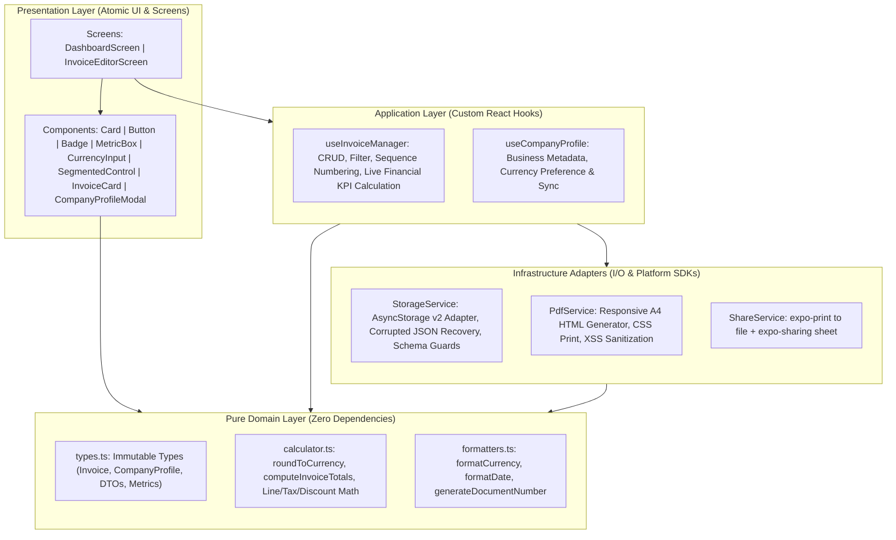

# Facturix ⚡

<p align="center">
  
</p>

<p align="center">
  <strong>100% Offline, Privacy-First Invoice & Quote Generator for Mobile</strong>
</p>

<p align="center">
  
  
  
  
  
  
  
</p>

---

## Table of Contents
1. [Overview](#overview)
2. [Key Value Propositions](#key-value-propositions)
3. [Application Usage Flow Diagram](#application-usage-flow-diagram)
4. [Architecture & System Design](#architecture--system-design)
5. [In-Depth Feature Technical Details](#in-depth-feature-technical-details)
   - [1. Business Profile & Multi-Currency System](#1-business-profile--multi-currency-system)
   - [2. Dashboard & Financial KPI Analytics Engine](#2-dashboard--financial-kpi-analytics-engine)
   - [3. Document Composer & Dynamic Line Items](#3-document-composer--dynamic-line-items)
   - [4. Pure Domain Mathematical & Formatting Engine](#4-pure-domain-mathematical--formatting-engine)
   - [5. Resilient Offline Storage Adapter](#5-resilient-offline-storage-adapter)
   - [6. Standalone A4 PDF Compiler & Native Sharing Pipeline](#6-standalone-a4-pdf-compiler--native-sharing-pipeline)
6. [Directory Structure](#directory-structure)
7. [Getting Started (with Bun)](#getting-started-with-bun)
8. [Testing & Quality Assurance](#testing--quality-assurance)
9. [Build & Distribution](#build--distribution)

---

## Overview

**Facturix** is a high-performance, mobile-first invoice and quote generation application designed for freelancers, contractors, and small business owners. Built upon **Expo SDK 57**, **React Native 0.86**, and **React 19**, Facturix operates entirely client-side with zero external cloud dependencies, zero data collection, and zero network calls.

Your client records, billing totals, and financial records reside exclusively on your physical device.

---

## Key Value Propositions

- **100% Offline & Private**: No analytics trackers, no user logins, no databases in the cloud. Data is saved in sandboxed local device storage.
- **Clean Architecture & SoC**: Strict separation between pure domain business logic, infrastructure adapters (AsyncStorage, Expo Print, Expo Sharing), application hooks, and atomic presentational components.
- **Deterministic Financial Arithmetic**: All totals, VAT calculations, and discounts are computed using standard half-up / banker's 2-decimal rounding (`roundToCurrency`) to eliminate IEEE-754 floating-point inaccuracies.
- **Production-Ready PDF Engine**: Responsive A4 print template with clean typography, zebra striping, currency normalization, and automatic integration with native iOS/Android sharing sheets.
- **Enterprise-Grade Test Suite**: 88 unit and integration tests covering domain math, adapters, state management, components, and user screen workflows with 100% domain coverage.

---

## Application Usage Flow Diagram

The following diagram illustrates the complete user journey and state transitions through Facturix:

```mermaid
flowchart TD
    Start([App Launch / Cold Start]) --> InitStorage[Initialize Local Storage Adapter]
    InitStorage --> LoadProfile[Fetch Business Profile from Device]
    InitStorage --> LoadInvoices[Fetch Invoices from Device]

    LoadProfile & LoadInvoices --> Dashboard[Dashboard Screen]

    %% Dashboard actions
    Dashboard --> ViewKPIs[Review KPI Metrics:<br/>Total Billed | Pending | Paid]
    Dashboard --> FilterInvoices{Filter Invoices}
    FilterInvoices -->|All| ShowAll[Display All Documents]
    FilterInvoices -->|Invoices| ShowInvoices[Display Invoices Only]
    FilterInvoices -->|Quotes| ShowQuotes[Display Quotes Only]

    Dashboard --> ToggleStatus[Toggle Status Pill:<br/>PENDING ⟷ PAID]
    ToggleStatus --> UpdateStore[Persist Updated Status to Storage]
    UpdateStore --> RefreshKPIs[Auto-recalculate Live Metrics]
    RefreshKPIs --> Dashboard

    Dashboard --> OpenSettings[Tap Settings Button]
    OpenSettings --> ProfileModal[Company Profile Modal]
    ProfileModal --> EditProfile[Edit Name, Address, Tax ID, Currency]
    EditProfile --> SaveProfile[Persist Profile to Storage]
    SaveProfile --> Dashboard

    %% Create / Edit flow
    Dashboard --> TapCreate[Tap '+ New Document' FAB]
    Dashboard --> TapCard[Tap Existing Document Row]

    TapCreate --> NewDoc[Open InvoiceEditorScreen: Fresh DTO]
    TapCard --> EditDoc[Open InvoiceEditorScreen: Existing Model]

    NewDoc & EditDoc --> SetType{Select Type}
    SetType -->|Invoice| InvSeq[Sequence: INV-YYYY-XXXX]
    SetType -->|Quote| QuoSeq[Sequence: QUO-YYYY-XXXX]

    InvSeq & QuoSeq --> EditClient[Fill Client Information]
    EditClient --> LineItems[Manage Line Items]
    
    LineItems --> AddItem[Add Dynamic Row]
    LineItems --> RemoveItem[Remove Row]
    LineItems --> EditPrice[Update Quantity or Unit Price]

    EditPrice --> LiveCalc[Pure Domain computeInvoiceTotals:<br/>Subtotal + Tax% - Discount%]
    LiveCalc --> UpdateSummaryCard[Render Real-time Totals Card]

    UpdateSummaryCard --> UserChoice{User Action}

    UserChoice -->|Cancel| Discard[Discard & Return to Dashboard]
    Discard --> Dashboard

    UserChoice -->|Save Only| ValidateSave[Validate Client & Item Descriptions]
    ValidateSave -->|Pass| CommitSave[Persist Document to Storage]
    CommitSave --> Dashboard

    UserChoice -->|Share PDF| ValidateShare[Validate Required Fields]
    ValidateShare -->|Pass| CommitDoc[Save Document to Storage]
    CommitDoc --> HTMLCompile[Generate Standalone A4 HTML with CSS Print]
    HTMLCompile --> PrintEngine[expo-print: Compile HTML to Local .pdf URI]
    PrintEngine --> NativeShare[expo-sharing: Present Native OS Share Sheet]
    NativeShare -->|Completed| Dashboard
```

---

## Architecture & System Design

Facturix enforces a strict **Clean Architecture / Hexagonal Architecture** layered model:



### Layer Constraints
1. **`src/domain/`**: Pure TypeScript. **Zero external imports** (no React hooks, no React Native components, no Expo APIs). Only pure functions and immutable data contracts.
2. **`src/services/`**: Infrastructure layer. Exposes strictly typed interfaces (`IStorageService`, `IShareService`). Implements third-party SDK calls and handles system I/O errors gracefully.
3. **`src/hooks/`**: Application state and orchestration. Contains business workflows. Screens do not perform direct arithmetic or storage operations.
4. **`src/components/` & `src/screens/`**: Purely presentational components consuming hooks and formatting utilities.

---

## In-Depth Feature Technical Details

### 1. Business Profile & Multi-Currency System

The business profile configures the sender's billing identity stamped across all generated documents and exported PDFs.

- **Primary Source Files**:
  - Model: [`CompanyProfile`](file:///home/hericraft/github/facturix/src/domain/types.ts)
  - Modal Component: [`CompanyProfileModal.tsx`](file:///home/hericraft/github/facturix/src/components/CompanyProfileModal.tsx)
  - Application Hook: [`useCompanyProfile.ts`](file:///home/hericraft/github/facturix/src/hooks/useCompanyProfile.ts)
  - Storage Key: `@facturix:company_profile:v1`
- **Supported Currencies**: `EUR` (€), `USD` ($), `GBP` (£), `CAD` (CA$), `CHF` (CHF), `MAD` (MAD).
- **Default Profile Attributes**:
  - `name`: Company or Freelancer legal name.
  - `taxNumber`: VAT, SIRET, GST, or Tax ID.
  - `email`, `phone`, `address`: Contact coordinates.
  - `currency`: Default ISO currency code.
  - `defaultPaymentTerms`: Custom default payment clause (e.g. *Payment due within 30 days of invoice date*).
- **Lifecycle & Synchronization**: Loaded asynchronously on application startup. Any modification committed in `CompanyProfileModal` automatically re-renders dashboard amounts and updates future PDF generation.

---

### 2. Dashboard & Financial KPI Analytics Engine

The main dashboard provides an instant, real-time snapshot of billing health.

- **Primary Source Files**:
  - Screen: [`DashboardScreen.tsx`](file:///home/hericraft/github/facturix/src/screens/DashboardScreen.tsx)
  - Hook: [`useInvoiceManager.ts`](file:///home/hericraft/github/facturix/src/hooks/useInvoiceManager.ts)
  - Widgets: [`MetricBox.tsx`](file:///home/hericraft/github/facturix/src/components/MetricBox.tsx), [`InvoiceCard.tsx`](file:///home/hericraft/github/facturix/src/components/InvoiceCard.tsx)
- **Real-Time Financial Metrics**:
  - **Total Billed**: Sum of `grandTotal` for all documents where `type === 'INVOICE'`.
  - **Collected / Paid**: Sum of `grandTotal` for all documents where `status === 'PAID'`.
  - **Pending Collection**: Sum of `grandTotal` for all invoices where `status === 'PENDING'`.
- **Segmented Filtering**:
  - `ALL`: Chronological order of all documents.
  - `INVOICES`: Filtered to invoices only.
  - `QUOTES`: Filtered to quotes only.
- **In-Place Status Toggle**: Users can tap the `PENDING` / `PAID` pill on any card to immediately toggle status and persist the update without opening the full editor.
- **Pull-to-Refresh & Empty State**: FlatList includes native pull-to-refresh and guidance for first-time document creation.

---

### 3. Document Composer & Dynamic Line Items

The invoice and quote composer enables fast, flexible composition of commercial documents.

- **Primary Source Files**:
  - Screen: [`InvoiceEditorScreen.tsx`](file:///home/hericraft/github/facturix/src/screens/InvoiceEditorScreen.tsx)
  - Components: [`CurrencyInput.tsx`](file:///home/hericraft/github/facturix/src/components/CurrencyInput.tsx), [`SegmentedControl.tsx`](file:///home/hericraft/github/facturix/src/components/SegmentedControl.tsx)
  - Types: [`CreateInvoiceDTO`](file:///home/hericraft/github/facturix/src/domain/types.ts), [`InvoiceItem`](file:///home/hericraft/github/facturix/src/domain/types.ts)
- **Document Numbering Sequence**:
  - Invoices automatically receive the next sequential number formatted as `INV-YYYY-XXXX` (e.g., `INV-2026-0001`).
  - Quotes receive `QUO-YYYY-XXXX` (e.g., `QUO-2026-0001`).
- **Dynamic Line Items**:
  - Users can add an arbitrary number of line items.
  - Each item supports `description`, integer `quantity` (minimum 1), and unit price in decimals.
  - Removing items is prevented if only 1 line item remains to maintain document integrity.
- **Live Arithmetic & Validation**:
  - Modifying quantities, unit prices, tax percentage, or discount percentage triggers an instant recalculation via `computeInvoiceTotals`.
  - Form validation prevents saving documents without a client name or with empty item descriptions.

---

### 4. Pure Domain Mathematical & Formatting Engine

Eliminates IEEE-754 floating-point inaccuracies in financial calculations.

- **Primary Source Files**:
  - Calculator: [`calculator.ts`](file:///home/hericraft/github/facturix/src/domain/calculator.ts)
  - Formatters: [`formatters.ts`](file:///home/hericraft/github/facturix/src/domain/formatters.ts)
- **Rounding Algorithm**:
  ```ts
  export function roundToCurrency(amount: number): number {
    return Math.round((amount + Number.EPSILON) * 100) / 100;
  }
  ```
- **Arithmetic Formulas**:
  - Line Total: $\text{lineTotal} = \text{roundToCurrency}(\text{quantity} \times \text{unitPrice})$
  - Subtotal: $\text{subtotal} = \sum \text{lineTotal}_i$
  - Tax Amount: $\text{taxAmount} = \text{roundToCurrency}(\text{subtotal} \times \text{taxRate})$
  - Discount Amount: $\text{discountAmount} = \text{roundToCurrency}(\text{subtotal} \times \text{discountRate})$
  - Grand Total: $\text{grandTotal} = \text{subtotal} + \text{taxAmount} - \text{discountAmount}$
- **Formatting Utilities**:
  - `formatCurrency(amount, currency)`: Localized formatting via `Intl.NumberFormat`.
  - `formatDate(isoString)`: Localized human-readable date strings (e.g., `Sep 10, 2026`).
  - `getDefaultDueDate(daysAhead)`: Calculates standard payment term offsets (e.g., Net 30).

---

### 5. Resilient Offline Storage Adapter

Encapsulates device key-value storage with defensive error handling and data recovery.

- **Primary Source Files**:
  - Adapter: [`storageService.ts`](file:///home/hericraft/github/facturix/src/services/storageService.ts)
  - Engine: `@react-native-async-storage/async-storage@2.2.0`
- **Defensive Strategies**:
  - **Schema Validation Guards**: Validates objects on read (`isValidInvoice`, `isValidCompanyProfile`) to filter out corrupted or invalid entries.
  - **Corrupted JSON Recovery**: Catches `SyntaxError` on corrupted local JSON data, logs a non-fatal warning, and recovers gracefully by falling back to default values.
  - **Multi-Engine API Adaptivity**: Supports `multiRemove`, `removeMany`, and parallel `removeItem` calls across different storage engines and Jest mock environments.

---

### 6. Standalone A4 PDF Compiler & Native Sharing Pipeline

Generates professional, responsive, print-ready PDF invoices and presents them to the operating system's native share sheet.

- **Primary Source Files**:
  - HTML Compiler: [`pdfService.ts`](file:///home/hericraft/github/facturix/src/services/pdfService.ts)
  - Sharing Bridge: [`shareService.ts`](file:///home/hericraft/github/facturix/src/services/shareService.ts)
- **PDF Layout & Styling**:
  - Embedded CSS print styles: `@page { size: A4 portrait; margin: 12mm; }`.
  - Responsive table layout with alternating zebra striping (`#f8fafc`).
  - Strict HTML escaping on all dynamic fields (`escapeHtml`) to prevent injection attacks.
  - Includes full breakdown: Client coordinates, issuer details, itemized table, subtotal, tax rate & amount, optional discount, grand total, payment terms, and offline disclaimer.
- **Native Sharing Orchestration**:
  1. Compiles the HTML template using `generateInvoiceHtml(invoice, profile)`.
  2. Calls `expo-print`'s `printToFileAsync({ html })` to compile a local `.pdf` file in device cache.
  3. Verifies platform sharing support using `expo-sharing`'s `isAvailableAsync()`.
  4. Calls `expo-sharing`'s `shareAsync(fileUri, { mimeType: 'application/pdf', UTI: 'com.adobe.pdf' })` to trigger AirDrop, Mail, WhatsApp, Drive, Google Files, or Bluetooth.

---

## Directory Structure

```
facturix/
├── assets/
│   ├── images/
│   │   └── facturix-logo.png     # Official high-resolution 1024x1024 app logo
│   └── expo.icon/                # Vector icon assets
├── src/
│   ├── app/                      # Expo Router navigation routes
│   │   ├── _layout.tsx           # Root navigation stack
│   │   ├── index.tsx             # Main dashboard route
│   │   └── editor.tsx            # Standalone editor route
│   ├── components/               # Atomic presentational components
│   │   ├── Badge.tsx             # Status & type indicators (Paid, Pending, Quote)
│   │   ├── Button.tsx            # Tactile buttons with loading & variants
│   │   ├── Card.tsx              # Elevated and bordered container
│   │   ├── CompanyProfileModal.tsx # Business metadata & currency modal
│   │   ├── CurrencyInput.tsx     # Numeric currency input with symbol prefix
│   │   ├── InvoiceCard.tsx       # Interactive document row in list
│   │   ├── MetricBox.tsx         # KPI summary metric widget
│   │   └── SegmentedControl.tsx  # Horizontal toggle switcher
│   ├── domain/                   # Pure business domain layer (Zero dependencies)
│   │   ├── calculator.ts         # Pure financial arithmetic & rounding
│   │   ├── formatters.ts         # Pure string/date/currency formatters
│   │   └── types.ts              # Immutable TypeScript interfaces & types
│   ├── hooks/                    # Application layer hooks
│   │   ├── useCompanyProfile.ts  # Settings state & local sync
│   │   └── useInvoiceManager.ts  # Invoices CRUD, filters, sequence, KPI totals
│   ├── screens/                  # Composite feature screens
│   │   ├── DashboardScreen.tsx   # Main screen with metric bar & invoice list
│   │   └── InvoiceEditorScreen.tsx # Invoice/Quote editor with live totals
│   └── services/                 # Infrastructure adapters (I/O & SDK bridges)
│       ├── pdfService.ts         # Standalone A4 HTML template compiler
│       ├── shareService.ts       # expo-print & expo-sharing coordinator
│       └── storageService.ts     # AsyncStorage adapter with data recovery
├── __tests__/                    # Jest & RNTL test suites (88 tests passing)
│   ├── calculator.test.ts        # 100% pure financial math coverage
│   ├── formatters.test.ts        # 100% formatters coverage
│   ├── storageService.test.ts    # Storage serialization & error handling
│   ├── pdfService.test.ts        # HTML generation & escaping tests
│   ├── shareService.test.ts      # Native share integration tests
│   ├── useCompanyProfile.test.ts # Settings hook state mutations
│   ├── useInvoiceManager.test.ts # CRUD, status toggling, and KPI calculations
│   ├── components.test.tsx       # Presentational component unit tests
│   └── screens.test.tsx          # Screen interaction & modal workflow tests
├── app.json                      # Expo application manifest & bundle identifier (io.granix.facturix)
├── eas.json                      # Expo Application Services build configuration
├── jest.config.js                # Jest test runner configuration with coverage thresholds
├── jest.setup.js                 # Global test environment mocks
├── package.json                  # Dependencies & scripts
└── tsconfig.json                 # TypeScript strict compiler configuration
```

---

## Getting Started (with Bun)

### Prerequisites
- [Bun](https://bun.sh/) (v1.1+ recommended) or Node.js (v20+)
- Android Studio / Android Emulator or Xcode / iOS Simulator (optional for native testing)
- Expo Go app on your physical device for mobile testing

### 1. Install Dependencies
```bash
bun install
```

### 2. Verify Expo SDK 57 Package Alignment
```bash
bunx expo install --check
```

### 3. Start the Development Server
```bash
# Start interactive Expo menu
bunx expo start

# Or directly target Android
bunx expo start --android

# Or directly target iOS
bunx expo start --ios

# Or run in Web browser
bunx expo start --web
```

---

## Testing & Quality Assurance

Facturix comes with a complete suite of unit and integration tests using **Jest**, **jest-expo**, and **@testing-library/react-native**.

### Run Unit Tests
```bash
bun run test
```

### Run Tests with Code Coverage
```bash
bun run test -- --coverage
```

### Current Test Coverage Results:
- **`src/domain/calculator.ts`**: **100% Statements, 100% Lines**
- **`src/domain/formatters.ts`**: **100% Statements, 100% Lines**
- **`src/services/pdfService.ts`**: **100% Statements, 100% Lines**
- **`src/services/shareService.ts`**: **95.2% Statements, 95.2% Lines**
- **`src/components/`**: **95.8% Statements, 95.8% Lines**
- **`src/hooks/useCompanyProfile.ts`**: **89.7% Statements, 89.7% Lines**
- **`src/hooks/useInvoiceManager.ts`**: **85.4% Statements, 84.4% Lines**
- **`src/services/storageService.ts`**: **79.0% Statements, 80.0% Lines**

### Run Static Type Analysis
```bash
bunx tsc --noEmit
```
*(Guarantees 0 TypeScript errors across the entire codebase)*

---

## Build & Distribution

Facturix is configured under the package name **`io.granix.facturix`**.

### Build Android APK for Testing (via EAS)
```bash
bunx eas-cli build --platform android --profile preview
```

### Build Production Android App Bundle (.aab)
```bash
bunx eas-cli build --platform android --profile production
```

---

## License
MIT License. Built with privacy and craft by Granix.
